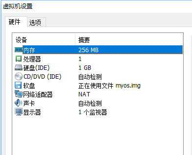

# 实验项目：加载用户程序的监控程序 

> 学习x86汇编

## 实验题目

制作多个二进制程序写入镜像，并用按键选择执行功能。

## 实验目的
了解cpu的引导过程，了解cpu控制外部设备（如软盘、键盘）的方式，理解简单版本的“操作系统”。

## 实验要求
1. 编写至少3份汇编代码，独立编译成二进制文件，写入不同的扇区。
2. 在引导扇区的程序中实现根据不同按键载入并执行要求1中的不同程序的功能。
3. 要求1中的程序要求必须具备显示以及返回主程序的功能。
4. 使用上述程序制作引导镜像。

## 实验方案

### 硬件及虚拟机配置 



### 软件工具及作用
- vscode: 编辑x86汇编代码（后缀名为.asm）。
- nasm: 编译汇编代码产生二进制文件（后缀名为.bin）
- VMware: 虚拟机，用来运行产生的二进制文件。

### 程序功能
1. 主程序（位于第0扇区）：列出可选的程序列表，可通过数字选择程序运行。
2. 程序1（位于第1扇区）：输出Hello, world。输入esc可返回主程序。
3. 程序2（位于第2扇区）：输入一个整数，输出相应个数的*。输入esc可返回主程序。
4. 程序3（位于第3扇区）：输入一个整数，输出对应的三角形（由*构成）。输入esc可返回主程序。

### 程序设计
1. 主程序(myos.asm)：

    ```Assembly
    ;程序源代码(myos.asm)
    org 7c00h           ;BIOS把引导扇区加载到0:7c00h处，并开始执行
    OffSetOfUserPrg1 equ 8100h

    Start:
        ; 初始化段寄存器
        mov ax, cs                  ; 置其他段寄存器值与CS相同
        mov ds, ax                  ; 数据段

        ; 清空屏幕
        mov ax, 0003h  
        int 10h    
        
        mov bp, Message             ; bp=串偏移地址
        mov ax, ds                  ; es = ds
        mov es, ax          
        mov cx, MessageLength       ; cx = 串长 
        mov ax, 1301h               ; 功能和光标位置
        mov bx, 0007h               ; 页号和黑底白字
        mov dx, 0000h               ; 行号和列号
        int 10h

    Input:
        ; 阻塞等待输入
        mov ah, 0                   ; 输入
        int 16h                     ; 16号中断

        ; 检查是否在1~3之间，不是则重新输入
        mov ah, 0
        cmp ax, '0'                 ; <= 0 重新输入
        jbe Input
        cmp ax, '3'                 ; >3 重新输入
        ja Input

        sub ax, '0'         
        add ax, 1
        mov cl, al                  ; 获取要读取的扇区号

    LoadnEx:
        ; 读取软盘内容到内存的ES:BX处
        mov ax, cs                  ; 段地址，存放数据的内存基地址
        mov es, ax                  ; 设置段地址
        mov bx, OffSetOfUserPrg1    ; 存放数据的内存偏移地址
        mov ah, 2                   ; 功能号
        mov al, 3                   ; 读取3个扇区
        mov ch, 0                   ; 柱面号
        ; mov cl, 4                   ; 起始扇区号，起始编号为1
        mov dh, 0                   ; 磁头号0
        mov dl, 0                   ; 驱动器号，0光驱
        int 13h

        jmp OffSetOfUserPrg1

    AfterRun:
        jmp $

    Message:
        db 'MyOS is running...', 0ah, 0dh, '1->Hello | 2-> ReadInt | 3-> Triangle', 0ah, 0dh, '>>> '
    MessageLength equ ($-Message)
        times 510-($-$$) db 0
        db 0x55, 0xaa
    ```

    Start部分初始化段寄存器，清空屏幕，以及输出各程序的提示信息。
    Input部分等待输入，并检测输入是否在1~3之间，若是则计算对应程序所在的扇区号（并mov到cl中，一会读磁盘中断会用到），不是则重新输入直到输入正确位置。
    LoadnEx部分准备读磁盘中断相应的信息，将cl所指的扇区内容加载到内存地址为8100h的地址后。完成加载后跳转到内存8100h地址。
    主程序部分结束。
    倒数两行是为了满足第0扇区必须以55AA结尾的要求。

2. 程序1（Hello.asm）:

    ```
    ;程序源代码（hello.asm）
    org  8100h		
    Start:
        ; 初始化段寄存器
        mov	ax, cs	       ; 置其他段寄存器值与CS相同
        mov	ds, ax	       ; 数据段

        ; 清空屏幕
        mov ax, 0003h  
        int 10h    
        
        mov	bp, Message		    ; BP=当前串的偏移地址
        mov	ax, ds		        ; ES:BP = 串地址
        mov	es, ax		        ; 置ES=DS
        mov	cx, MessageLength   ; CX = 串长（=9）
        mov	ax, 1301h		    ; AH = 13h（功能号）、AL = 01h（光标置于串尾）
        mov	bx, 0007h		    ; 页号为0(BH = 0) 黑底白字(BL = 07h)
        mov dh, 0		        ; 行号=0
        mov	dl, 0			    ; 列号=0
        int	10h			        ; BIOS的10h功能：显示一行字符

    Escape:
        mov ah, 0               ; 阻塞输入
        int 16h
        mov ah, 0                ; 检查输入是否为esc，不是则继续等待输入
        cmp ax, 1bh
        jne Escape

        ; 返回第0扇区
        mov ax, ZeroSector
        jmp ax

    Message:
        db 'Hello, world.', 0ah, 0dh, 'Enter esc to return.'
    MessageLength equ ($-Message)

    ZeroSector equ 7c00h
    ```

	Start部分清空屏幕，并输出字符串“Hello, world.”
	Escape部分阻塞输入，检查输入是否为esc，不是则跳回Escape重新输入，是则跳转到第0扇区，跳转前不用重新加载第0扇区的内容，直接跳回内存地址为0x0000:0x7c00的部分即可，因为第0扇区的内容在开机时已经被加载过了。

3. 程序2（readInt.asm）

    ```
    ; 功能：读取一个整数并输出相应个数的*号
    org 8100h           
    Start:
        mov ax, cs          ; 初始化段寄存器
        mov ds, ax          ; 数据段

        ; 清空屏幕
        mov ah, 0           
        mov al, 03h         ; 80x25 彩色方式
        int 10h             ; 10号中断

        ; 显示初始信息
        mov ax, cs          
        mov es, ax          ; ES=CS
        mov bp, Message     ; ES:BP为字符串地址
        mov ax, 1301h       ; 显示字符串，光标跟随移动
        mov bx, 0007
        mov cx, MessageLength   ;串长
        mov dx, 0           ; 行号列号均为0
        int 10h

    Input:
        ; 读取一个1-9的整数，不在范围内的均重新输入
        mov ah, 0
        int 16h

        ; 检查输入
        mov ah, 0
        cmp ax, '0'
        jbe Input
        cmp ax, '9'
        ja Input
        
        push ax
        ;在光标位置显示输入数字
        mov ah,0eh ;0eh号调用
        mov bl,07h ;白底黑字
        int 10h ;屏幕中断
        ;换行与回车
        mov ah,0eh ;0eh号调用
        mov al,0ah ;显示换行
        int 10h ;屏幕中断
        mov al,0dh ;显示回车
        int 10h ;屏幕中断

        pop ax
        mov ah, 0
        sub ax, '0'
        push ax

    loop1:
        mov ah, 0eh                 ; 输出字符
        mov al, '*'
        mov bl, 07h
        int 10h
        pop ax
        sub ax, 1
        push ax
        cmp ax, 0
        ja loop1
        mov ah,0eh 
        mov al,0ah 
        int 10h 
        mov al,0dh 
        int 10h 

    Return:
        ; 输出返回提示信息
        mov bp, ReturnMsg           ; ES:BP为字符串地址
        mov ax, 1301h               ; 显示字符串，光标跟随移动
        mov bx, 0007
        mov cx, ReturnMsgLength     ;串长
        mov dx, 0200h               ; 行号=2 列号=0
        int 10h

    ReadESC:
        ; 读取esc
        mov ah, 0
        int 16h

        ; 检查输入
        mov ah, 0
        cmp ax, 1bh
        jne ReadESC

        ; 返回第0扇区
        mov ax, ZeroSector
        jmp ax

    Message:
        db 'Please input a number(1 to 9): '
    MessageLength equ ($-Message)

    ReturnMsg:
        db 'Enter esc to return.'
    ReturnMsgLength equ ($-ReturnMsg)

    ZeroSector equ 7c00h
    ```


    Start部分初始化段寄存器，清空屏幕，以及输出提示信息。
    Input部分读取输入并检查输入是否在1~9之间，不是则重新输入。是则将这个数字输出在屏幕上。
    loop1部分循环打印*，打印次数为刚刚输入的数字。
    Return部分打印退出提示信息
    ReturnESC读取esc，不是则重新读取，是则返回内存地址7c00h。

4. 程序3（triangle.asm）

    ```
    org  8100h
    main:

    ;初始化段寄存器
    mov ax, cs         ; 置其他段寄存器值与CS相同
    mov ds, ax         ; 数据段
    mov ax, ds       ; ES:BP = 串地址
    mov es, ax       ; 置ES=DS

    mov ax, 0003h
    int 10h

    mov bp, Message      ; BP=当前串的偏移地址
    mov ax, ds       ; ES:BP = 串地址
    mov es, ax       ; 置ES=DS
    mov cx, MessageLength  ; CX = 串长（=9）
    mov ax, 1301h        ; AH = 13h（功能号）、AL = 01h（光标置于串尾）
    mov bx, 0007h        ; 页号为0(BH = 0) 黑底白字(BL = 07h)
    mov dh, 0              ; 行号=0
    mov dl, 0            ; 列号=0
    int 10h          ; BIOS的10h功能：显示一行字符

    Input:
    ;读入键盘输入
    ;ah = 0, int 16h:阻塞式读取键盘输入
    mov ah,0 ;　　 0号调用
    int 16h ;　　　 输入字串

    ;键盘输入的返回结果在AL
    mov ah,0
    cmp ax, 1bh
    je LoadBoot
    cmp ax,'0' ;和'0'比较
    jbe Input
    cmp ax,'9' ;和'9'比较
    ja Input

    ;下面要把输入的数字显示出来，先把ax的内容存起来
    push ax

    ;在光标位置显示输入数字
    mov ah,0eh ;0eh号调用
    mov bl,07h ;白底黑字
    int 10h ;屏幕中断
    ;换行与回车
    mov ah,0eh ;0eh号调用
    mov al,0ah ;显示换行
    int 10h ;屏幕中断
    mov al,0dh ;显示回车
    int 10h ;屏幕中断

    ;显示完输入数字，重新取回ax
    pop ax

    sub ax,'0' ;减去'0'
    push ax
    push ax

    cmp ax,0
    jbe Escape

    loop1:
    ;在光标位置显示*
    mov ah,0eh ;0eh号调用
    mov al,'*' ;显示*
    mov bl,07h ;白底黑字
    int 10h ;屏幕中断

    ;循环变量减一
    pop ax
    sub ax,1
    push ax

    ;当循环变量大于0时继续循环
    cmp ax,0
    ja loop1
    pop ax

    ;换行与回车
    mov ah,0eh ;0eh号调用
    mov al,0ah ;显示换行
    int 10h ;屏幕中断
    mov al,0dh ;显示回车
    int 10h ;屏幕中断

    ;循环变量减一
    pop ax
    sub ax,1
    push ax
    push ax

    ;当循环变量大于0时继续循环
    cmp ax,0
    ja loop1

    Escape:
        mov ah, 0               ; 阻塞输入
        int 16h
        mov ah, 0                ; 检查输入是否为esc，不是则继续等待输入
        cmp ax, 1bh
        jne Escape

    LoadBoot:
        ; 返回第0扇区
        mov ax, ZeroSector
        jmp ax

    Message:
        db 'Input a Number(esc to return): ', 0ah, 0dh
    MessageLength equ ($-Message)

    ZeroSector equ 7c00h
    ```

	main部分初始化段寄存器，并清空屏幕，输出提示信息。
	input部分等待键盘输入，并检测输入是否为esc，是的话跳转到LoadBoot部分；不是则检查输入是否在1~9之间，不是的话则跳转回input重新检测输入，是的话则输出这个数在屏幕上，并push两次进栈中准备下一步的循环操作。
	loop1部分是循环过程，每一次循环输入一行*号，个数为n（初始状态n等于输入的数字，每次循环递减1）。循环次数为输入的数值。
	Escape部分为循环结束后阻塞键盘输入，检测输入是否为esc，若不是则继续等待输入，是则继续。
    LoadBoot部分跳转回内存地址0x0000:0x7c00h处。

## 编译过程

在命令行中输入

```
nasm –o xxx.bin xxx.asm
```

## 虚拟机设置
创建一个新的虚拟机，客户操作系统和版本均选择为其他，其余保持默认选项（可以将内存修改小一点）。
创建完成后，点击编辑虚拟机设置，硬件添加软盘，选择空的映像文件并创建，然后点击确认：

## 映像写入

利用Hxd打开之前创建的几个文件（利用nasm产生的4个.bin文件以及映像文件myos.img）。并把4个.bin文件的内容移到myos.img的对应扇区（注意到每个扇区的大小为512Bytes，512对应16进制的0x200）。

主程序`myos.bin`的内容复制后在`myos.img`的`00000000`位置处以覆盖方式粘贴。程序1`hello.bin`的内容复制后在`myos.img`的`00000200`位置处以覆盖方式粘贴。程序2`readInt.bin`的内容复制后在`myos.img`的`00000400`位置处以覆盖方式粘贴。程序4`triangle.bin`的内容复制后在`myos.img`的`00000600`位置处以覆盖方式粘贴。

## 实验总结

本次实验主要学习了如何利用x86编写程序，以及x86中断的使用，通过中断可以对硬件进行操作。同时也理解了引导扇区、引导扇区程序它们的作用。

计算机在启动后会将第0扇区的内容载入到内存地址为7c00h处，然后cpu会从这个位置开始读取指令执行，一般称这个扇区为引导扇区。引导扇区的程序主要负责跳转到别的扇区部分去执行指令，比如可以引导到操作系统所在的扇区。本次实验引导程序只是引导到三个小程序，由此联想到当一台计算机上有多个操作系统时可以通过引导扇区程序来进行引导，从而进入不同的操作系统。

## 参考文献

x86汇编语言-从实模式到保护模式 