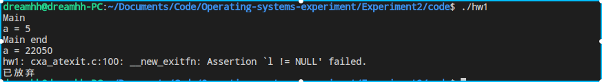
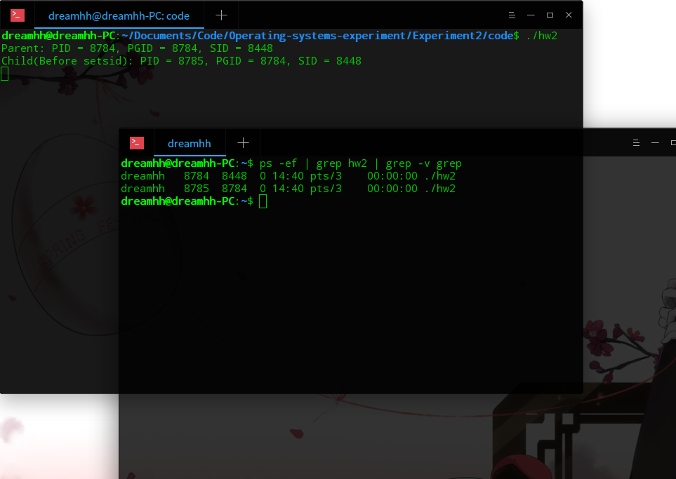
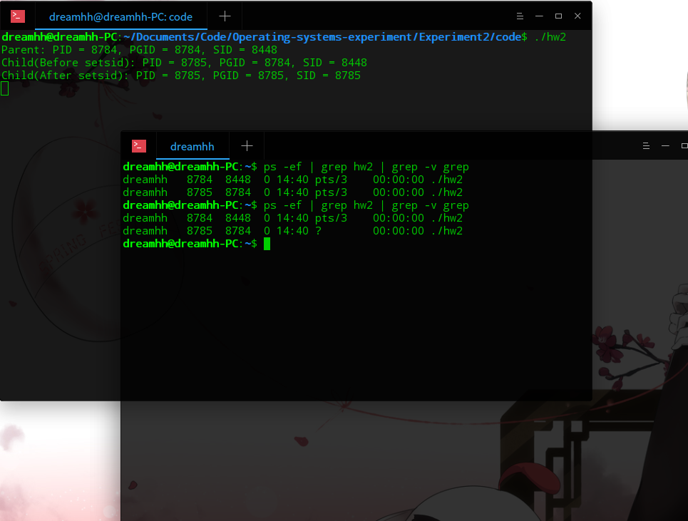
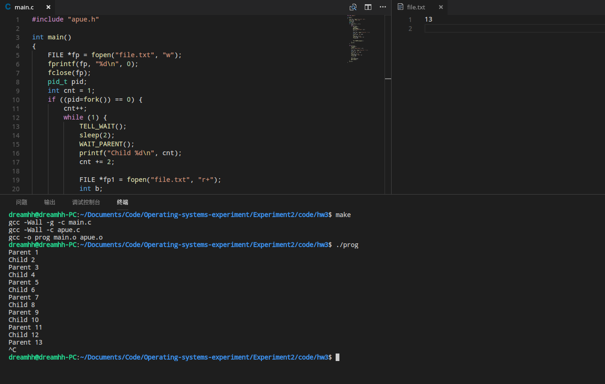

# 实验项目 2：Unix进程

## 实验题目

Unix进程

## 实验目的

1. 理解Unix系统下与进程相关的编程操作。
2. 理解Unix系统下进程的组织方法与进程间的相互关系。
3. 理解IPC通信中信号通信的原理与操作。

## 实验要求

1. 调用vfork后，子程序运行在父进程的地址空间中。如果不是在main函数中调用vfork，而是在vfork以后子进程从这个函数返回，那将会如何？请编写一段程序验证并画出堆栈中的映像。
2. 编写一段程序，要求调用fork并在子进程中建立一个新的对话期。验证子进程变成了进程组组长并且不再有控制终端。
3. 编写一段程序测试程序10-17中父进程和子进程的同步函数，要求进程创建一个文件并向文件写一个整数0，进程调用f o r k后父进程和子进程交替增加文件中的计数器的值，并打印哪一个进程(子进程或父进程)进行了增1操作。

## 代码解释

### 1.

```c
#include <sys/types.h>
#include <unistd.h>
#include <stdio.h>
#include <stdlib.h>

void func()
{
    int a = 5;
    vfork();
    printf("a = %d\n", a);
    return;
}

int main() 
{
    printf("Main\n");
    func();
    printf("Main end\n");
    return 0;
}
```

`main` 函数中调用`func`函数，`func`函数中创建一个局部变量a,`vfork`后父子进程都输出a的值并返回`main`函数。

### 2.

```c
#include <stdlib.h>
#include <stdio.h>
#include <sys/types.h>
#include <unistd.h>

int main() 
{
    pid_t pid;
    if ((pid=fork()) == 0) {
        printf("Child(Before setsid): PID = %d, PGID = %d, SID = %d\n", getpid(), getpgid(0), getsid(0));
        sleep(5);
        setsid();
        printf("Child(After setsid): PID = %d, PGID = %d, SID = %d\n", getpid(), getpgid(0), getsid(0));
    } else {
        printf("Parent: PID = %d, PGID = %d, SID = %d\n", getpid(), getpgid(0), getsid(0));
    }

    sleep(10);

    return 0;
}
```

`main`函数中fork，子进程先输出创建会话之前的子进程的ID,进程组ID和会话期ID。Sleep5秒（这个期间查看一次父子进程的控制终端）后，创建会话，并输出此时的子进程的ID,进程组ID和会话期ID。

查看控制终端可开一个新的Terminal输入`ps -ef | grep xxx | grep -v grep`，查看tty一栏，“?”表示无控制终端。xxx为所运行程序的文件名。

### 3.

main.c的内容如下，apue.c和apue.h与其放在同一个文件夹下并一同编译链接。

```c
#include "apue.h"

int main() 
{  
    FILE *fp = fopen("file.txt", "w");
    fprintf(fp, "%d\n", 0);
    fclose(fp);
    pid_t pid;
    int cnt = 1;
    if ((pid=fork()) == 0) {
        cnt++;
        while (1) {
            TELL_WAIT();
            sleep(2);
            WAIT_PARENT();
            printf("Child %d\n", cnt);
            cnt += 2;

            FILE *fp1 = fopen("file.txt", "r+");
            int b;
            fscanf(fp1, "%d", &b);
            b++;
            fseek(fp1, 0, 0);
            fprintf(fp1, "%d\n", b);
            fclose(fp1);

            
            TELL_PARENT(getppid());
        }
        exit(0);
    }
    
    while (1) {
        TELL_WAIT();
        sleep(1);
        printf("Parent %d\n", cnt);

        FILE *fp2 = fopen("file.txt", "r+");
        int a;
        fscanf(fp2, "%d", &a);
        a++;
        fseek(fp2, 0, 0);
        fprintf(fp2, "%d\n", a);
        fclose(fp2);

        cnt += 2;
        TELL_CHILD(pid);
        WAIT_CHILD();
    }
    exit(0);
}
```

第一步创建一个file.txt文件并向其写入0。然后`fork`之后产生子进程，父子进程都有一个循环用来计数，每次循环都需要调用一次`TELL_WAIT()`，用以注册handler和设置屏蔽字。WAIT_*表示阻塞等待信号，TELL_*用来发送信号。

让父进程先执行，故需要子进程WAIT_PARENT，父进程读写文件增1后`TELL_CHILD`，告诉子进程可以执行了，并`WAIT_CHILD`。子进程收到信号后进行读写文件增1，然后`TELL_PARENT`，并`WAIT_PARENT`等待下一轮执行，父进程收到信号后开始执行，然后重复这个过程。

每次执行的具体内容为，在终端打印当前进程是父进程还是子进程，利用`fscanf`读取文件中的数字，增1操作后写到文件开头处，故需要`fseek()`定位到初始位置，然后`fprintf()`写入增加后的数字，然后`fclose()`将缓冲区的内容写入文件。

## 实验结果

### 1.



Vfork后子进程先执行，子进程输出局部变量a=5，Main end表示子进程已经返回main函数并退出了。接下来父进程输出的局部变量a=22050，是一个垃圾值，说明原来的a已经出过stack，故这个a是个不确定值。因此返回地址应该也被pop过了，父进程是无法返回main函数的，从上面的截图也可以看到，父进程不知道返回地址，也有可能是一个非法地址从而触发段错误，总之返回main的地址在执行子进程的时候被pop。

### 2. 

分别在创建会话前后调用`ps -ef | grep xxx | grep -v grep`查看tty（第6列）：



注意到创建新会话前父子进程的进程组组长均为8784，即父进程为进程组组长，且控制终端均为pts/3。



创建新会话后，子进程的进程组组长变为8785，即子进程本身，从SID中可看到父子进程属于不同的会话。且紫禁城的控制终端变为“?”，即无控制终端。

### 3. 



最终运行效果如上图，可用`ctrl+c`中断程序运行，file.txt的最终内容是最后一次父进程写入的13。

Hw3目录下有代码，`make`编译后运行`./prog`可查看具体效果。

## 实验总结

这次实验遇到的一些问题，这里进行总结：

- 一开始没有区分开vfork和fork的区别，通过实验1对vfork父子进程共享存储空间有了进一步了解。

- 对信号集的概念有了进一步认识，最初接触以为是一个类似于队列的结构，后来查阅相关资料才知道是linux预先定义好的64个信号组成的集合。

- 关于屏蔽字、阻塞信号集，linux设置一个屏蔽字mask，进程会接收屏蔽字中的信号，但不会执行相应的handler，只有当改变了屏蔽字不再阻塞某个接收到的信号时，该信号的handler才会执行。

- 关于signal的一点问题，个人觉得signal这个函数实现的有些问题，一开始以为会像js中注册一个事件的回调函数一样，注册一次就可以一直使用。但多次测试后发现并非如此，例如对某些信号（如SIGUSR1、SIGUSR2），当执行过其handler后，就无法再次捕捉信号，如果想捕捉需要重新用signal注册，但是在对另一些信号（如SIGINT、SIGALRM）测试的时候发现可以重复捕捉信号并执行handler，具体原因还未找到，查阅资料后也只是说应避免使用signal，推荐使用sigaction。

学习到的新知识：

- Vfork()函数、fork()函数的使用。

- 利用signal、kill进行进程间的通信。

- 利用ps查看进程信息，可以结合grep进行查找特定进程或某一类进程。