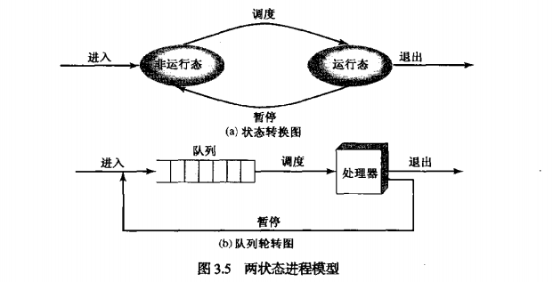
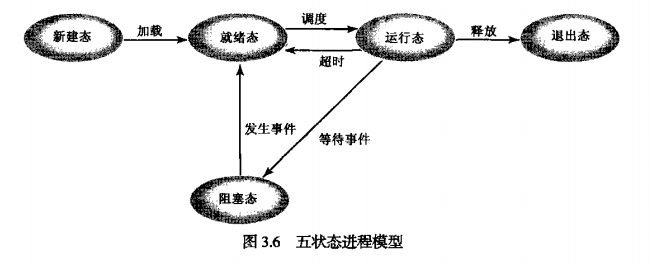
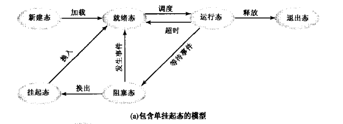
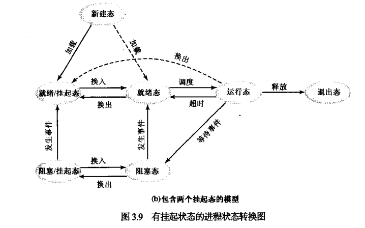
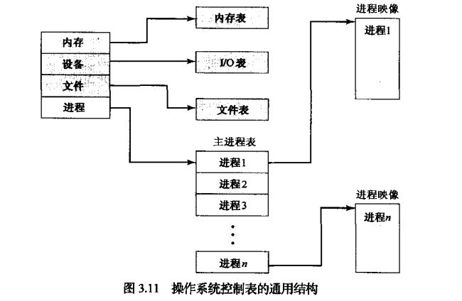
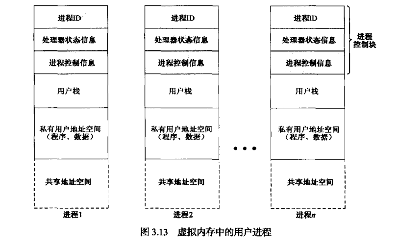
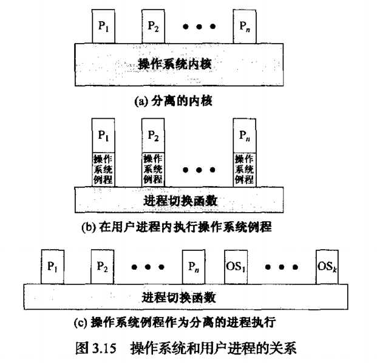
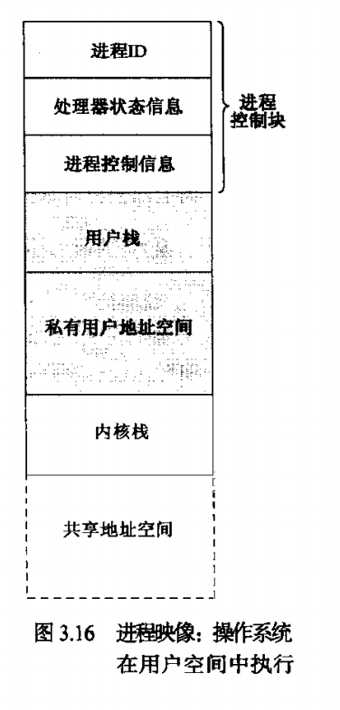

# 进程描述和控制

> 定义进程并解释进程与控制块之间的关系 
> 理解进程状态和进程状态转换的过程 
> 了解操作系统管理进程所用的数据结构，列出相关数据结构并解释其目的 
> 评估操作系统对进程控制的需求 
> 掌握操作系统代码运行时涉及的问题

## 1. 什么是进程

### 1.1 定义

**进程**有如下几个定义：

- 一个正在执行的程序。
- 一个正在计算机上执行的程序实例。
- 能分配给处理器并由处理器执行的实体。
- 由一组执行的指令、一个当前状态和一组相关的系统资源表征的活动单元。

进程的两个基本元素是**程序代码**和**数据集**。

### 1.2 进程控制块

进程执行的任意时刻，都可以用以下元素来表征：

- 标识符：与进程相关的唯一标识符，用来区分其他进程。
- 状态：进程有多种状态如运行态、就绪态等等。
- 优先级：相对于其他进程的优先顺序。
- 程序计数器：程序中即将执行的下一条指令的地址。
- 内存指针：包括程序代码和进程相关数据的指针，以及与其他进程共享内存块的指针。
- 上下文数据：进程执行时处理器的寄存器中的数据。
- I/O状态信息：包括显式I/O请求，分配给进程的I/O设备和被进程使用的文件列表。
- 记账信息：包括处理器时间总和、使用的时钟数总和、时间限制、记账号等。
- ...

上述列表信息放在**进程控制块**（process control block, PCB）的数据结构中。控制块由操作系统创建和管理。进程中断时，操作系统会把程序计数器和处理器寄存器（上下文数据）保存到进程控制块中的相应位置，进程状态相应的改为其它值。

因此可以说进程由程序代码和相关数据及进程控制块组成。

## 2. 进程状态

**轨迹**：列出进程执行的指令序列，可描述单个进程的行为，这样的序列称为进程轨迹。

**分配器**：也叫调度器，使处理器能够切换进程。

### 2.1 两状态进程模型

进程可处于以下两种状态之一：**运行态**或**未运行态**。

操作系统创建一个新进程时，它将以该进程以未运行态加入系统，操作系统知道这个进程的存在并等待执行机会。时不时地分配器会中断当前执行的进程，然后分配器会选择一个新进程执行。

未运行态进程必须位于某种类型的队列中，等待执行时机。

### 2.2 进程的创建和终止

#### 进程创建的原因

- 新的批处理作业
- 交互登录
- 为提供服务而由操作系统创建
- 由现有进程派生

#### 进程终止的原因

- 正常完成
- 超过时限
- 无可用内存
- 超出范围
- 保护错误
- 算数错误
- 时间超出
- I/O失败
- 无效指令
- 特权指令
- 数据误用
- 操作员或操作系统干涉
- 父进程终止
- 父进程请求

### 2.3 五状态模型

之前的两状态进程模型并不一定合适实际应用，因为它对队列中的进程不加以区分（全部归类为未运行态），如果从队列中取出某一个进程，它未必就能执行，因为它可能还在阻塞中（例如I/O还未准备完成）。解决的一个策略是将未运行态分为两个状态：**就绪态**和**阻塞态**，除此之外还添加两个被证明了很有用的状态，故出现了五状态模型：

- 运行态：进程正在执行。对于单CPU一次最多只有一个进程处于这个状态。
- 就绪态：进程做好了准备，只要有机会就开始执行。
- 阻塞态（等待态）：进程在某些事件发生前不能执行，如I/O操作完成。
- 新建态：刚刚创建的进程，操作系统还未把它加入可执行进程组，通常是进程控制块已经创建但未被加载到内存中的进程。
- 退出态：操作系统从可执行进程组中释放出的进程。

### 2.4 被挂起的进程

早期还没有虚拟内存的时候，我们内存空间有限，如果依照之前的五状态模型，可能会出现一种情况，队列中等待的进程越来越多，而这些在队列中的进程依旧要占据内存的空间，内存空间会逐渐被越来越多的进程占据完。

解决这种窘境的策略有两种：

1. 扩充内存。这种方案有两个缺点，一是内存的造价很高，而是对内存空间增长的需求快于内存价格下降的速度。
2. 交换，即将内存中的某个进程的一部分或全部移到外存中。当系统中不存在就绪态的进程时，操作系统就把被阻塞的进程移动到外存中的**挂起队列**中，也就是临时“踢出”等待队列。

上面提到的那种交换方案是**包含单挂起态的模型**，只是把阻塞态进程挂起，然而把被阻塞的内存取回内存没有任何意义，因为它仍未做好执行的准备。

因此，将这是否在等待一个事件和是否被挂起分离开来，就出现了4种状态：

- 就绪态：进程已在内存中并可执行
- 阻塞态：进程已在内存中并等待一个事件
- 阻塞/挂起态：进程被挂起并等待一个事件
- 阻塞/就绪态：进程被挂起，但只要载入内存就可执行。

#### 挂起的进程特点

- 该进程不能立即执行
- 该进程可能再也可能不在等待一个事件，若在等待一个事件，那么阻塞条件不依赖于挂起条件，阻塞事件的发生不会使进程立即执行。
- 为阻止该进程执行，可通过代理使其置于挂起态，代理可以是进程本身，也可以是父进程或操作系统。
- 除非代理显示地命令系统进行状态转换，否则该进程无法从这一状态转移。

#### 挂起的原因

|事件|说明|
|:--|:--|
|交换|操作系统需要释放足够的内存空间，以调入并执行处于就绪态的进程|
|其他OS原因|操作系统可能挂起后台进程或工具程序进程，或挂起可能会导致问题的进程|
|交互式用户请求|用户希望挂起一个程序的执行，以便进行调试或关联资源的使用|
|定时|进程可被周期性地执行（如记账或系统监视进程），并在等待下一个时间间隔时挂起|
|父进程请求|父进程可能会希望挂起后代进程的执行，以检查或修改挂起的进程，或协调不同后代进程之间的行为|

## 3. 进程描述

### 3.1 操作系统的控制结构

操作系统为了管理进程和资源，必须掌握每个进程和资源的当前状态，普遍采用的方法是，操作系统构造并维护其管理的每个实体的信息表。主要有4种不同类型的表：内存、I/O、文件和进程。

**内存表**：用于跟踪内（实）存和外（虚）存。内存表必须包含如下信息：

- 分配给进程的内存。
- 分配给进程的外存。
- 内存或虚存块的任何保护属性，如哪些进程可以访问某些共享内存区域。
- 管理虚存所需要的任何信息。

**I/O表**：管理计算机系统中的I/O设备和通道。

**文件表**：文件表提供关于文件是否存在、文件在外存中的位置、当前状态和其他属性的信息。

**进程表**：管理进程的表，下面会详细讲。

### 3.2 进程控制结构

对一个进程进行剖分，它可以看做以下几个部分：

- 用户程序：一个进程必须包含一个程序或一组程序，用以执行。
- 用户数据：程序的执行离不开数据，如局部变量、全局变量以及常量。
- 栈：栈这种结构能参数传递，追踪函数调用过程。
- 进程控制块：包含了进程的各种属性用以控制进程，如进程ID、寄存器信息等。

以上4个部分构成了一个**进程映像**。OS管理进程时，进程映像必须有一部分处在内存中；执行进程时，必须将整个进程载入内存或至少在虚存中。

#### 进程控制块

进程控制块包含了进程的各种属性，将进程的属性信息划分为3类：进程标识信息（用以索引）、进程状态信息（内部信息）、进程控制信息（外部信息）。见下表：

**进程标识信息**：

- 标识符：存储在进程控制块中的数字标识符，包括：
    - 该进程的标识符（Process ID）
    - 父进程ID
    - 用户标识符（User ID）

**处理器状态信息**：

- 用户可见寄存器：用户模式下执行机器语言时可访问的寄存器。
- 控制和状态寄存器：用于控制处理器操作的各种处理器寄存器，包括：
    - 程序计数器
    - 条件码：最近算术或逻辑运算的结果
    - 状态信息：包括中断允许/禁止标志、执行模式
- 栈指针：每个进程有一个或多个栈，栈指针是用于保存栈顶的指针

**进程控制信息**：

- 调度和状态信息：OS执行调度功能所需的信息，典型的包括：
    - 进程状态
    - 优先级
    - 调度相关信息
    - 事件
- 数据结构：描述进程之间的关系，存放进程的数据结构。比如队列、环或其他结构
- 进程间通信：通过各种信号、标记和信息使两个无关的进程通信关联
- 进程特权：根据进程可访问的内存和执行指令的类型来赋予特权。
- 存储管理：包括指向描述分配给该进程的虚存的段表、页表的指针
- 资源所有权和使用情况：指示进程控制的资源，如打开一个文件，还可包含处理器或其他资源的使用历史，调度时需要这些信息。

虚存中的用户进程：

OS中的每个模块，包括那些涉及调度、资源分配、中断处理、性能监控和分析的模块，都能读取和修改进程控制块的内容，这就涉及到如何对进程控制块进行保护，保护的必要性在于：

- 一个例程（例如中断处理程序）中的错误可能会破坏进程控制块，进而破坏系统对受影响进程的管理能力。
- 进程控制块结构或语义中的设计变化可能会影响到OS中的许多模块。

OS通过一个处理程序例程来解决保护进程控制块的问题，它是读写进程控制块的唯一仲裁程序。

## 4. 进程控制

以上讲述了关于进程是有哪些部分组成的，接下来会讲述OS是如何利用相关信息去管理进程。

### 4.1 执行模式

开始讲解OS管理进程前，需要知道OS具有两种执行进程的模式：

- **用户模式**（user mode）：用户程序通常在该模式下进行，为了安全起见它不具有特权指令。
- **内核模式**（kernel mode）：内核模式下，软件会完全控制处理器及其所有指令、寄存器和内存，OS的内核运行在该模式下故叫做内核模式。

OS内核的典型功能：

- 进程管理：
    - 进程的创建和终止
    - 进程的调度和分配
    - 进程切换
    - 进程同步和进程间通信的支持
    - 管理进程控制块
- 内存管理：
    - 为进程分配地址空间
    - 交换
    - 页和段管理
- I/O管理：
    - 缓冲区管理
    - 为进程分配I/O通道和设备
- 支持功能
    - 中断处理
    - 记账
    - 监听

### 4.2 进程创建

前面介绍了创建进程的原因，以下是创建一个进程的步骤：

1. 为新进程分配一个唯一的进程标识符。
2. 为进程分配空间。
3. 初始化进程控制块。
4. 设置正确的链接，即进程所要放置在内存的数据结构中哪个部分，如等待队列、阻塞队列。
5. 创建或扩充其他数据结构，如OS为每个进程维护一个记账文件。

### 4.3 进程切换

该部分主要涉及3个问题：

- 进程切换的触发事件是什么？
- 进程切换和模式切换的区别？
- 要实现进程切换，OS需要对它控制的各种数据结构做什么？

#### 切换进程的触发事件

即中断，我们对中断进行细分，见下表：

|机制|原因|用途|
|--|--|--|
|中断|来自当前执行指令的外部|对异步外部事件的反应|
|陷阱|来自当前执行指令相关|处理一个错误或一个异常事件|
|系统调用|显示请求|调用操作系统函数|

**中断**的示例：

- 时钟中断
- I/O中断
- 内存失效（缺失）

#### 模式切换

当出现中断的时候，处理器会做如下工作：

1. 将程序计数器置为中断处理程序的开始地址。
2. 从用户模式切换为到内核模式，以便中断处理代码包含特权指令。

在处理器执行中断处理程序的第一条指令之前，需要将已中断进程的上下文保存到它的进程控制块中，要保存的上下文是中断处理程序可能改变的所有信息以及恢复被中断程序时的所有信息（如处理器状态信息）。还需要做什么取决中断处理程序的类型。

值得注意的是，触发中断并不意味着就要切换进程，可能的情况是，执行中断处理程序后，会继续执行被中断进程。因此，切换进程和模式切换是有区别的，或者可以这么认为：进程切换会引起模式切换（因为有中断产生），但模式切换并不意味着发生了进程切换。

#### 切换进程的步骤

切换进程时OS主要进行了如下工作：

1. 保存处理器的上下文，包括程序计数器和其他寄存器。
2. 更新当前的运行态进程的进程控制块，包括把进程的状态切换成另一个状态，还要更新其他相关的字段，如退出运行态的原因和记账信息。
3. 把该进程的进程控制块移到相应的队列。
4. 选择另一个进程执行。
5. 更新所选进程的进程控制块，包括把进程的状态改为运行态。
6. 更新内存管理数据结构。
7. 载入程序计数器和其他寄存器先前的值，将处理器的上下文恢复为所选进程的上下文。

## 5 OS的执行

OS是否也可以像其他软件一样被视为进程？这里提出了3种设计模型：**无进程内核**、**在用户进程内运行**、**基于进程的操作系统**。

### 5.1 无进程内核

运用在许多老操作系统中，这种方法是在所有进程外部执行操作系统内核（操作系统的各个例程的集中在内核里）。OS本身具有控制过程调用和返回的内存区域与系统栈。

进程的概念仅仅局限在用户程序中，OS代码则是在特权模式下单独运行的实体。

### 5.2 在用户进程内运行

这种设计模式下在用户进程的上下文中执行操作系统例程（因为一个进程可以包含多个程序）。如图(b)中所示，这种设计模式的进程映像如下图（OS例程的代码和数据在共享地址空间中）：

显然这种模式在不切换进程（用户进程间切换）的情况下，调用OS例程少了两次进程切换的代价。

需要注意的是当需要切换进程时，处理器的控制权会传递给一个进程切换例程，而这个进程切换例程是在进程中还是进程外取决于OS的设计者，当然通常来说最方便的做法是设计在进程外。

### 5.3 基于进程的操作系统

该设计模式下将每个OS例程视为分离的进程。主要的内核功能被组织为独立的进程，这有几个有点：

- 利用了鼓励使用模块化操作系统的程序设计原则，可使接口最小且最简单
- 有些非关键操作系统功能可简单地用独立的进程来实现
- 把OS作为一组进程来实现时，在多处理器和多机环境中很有用。