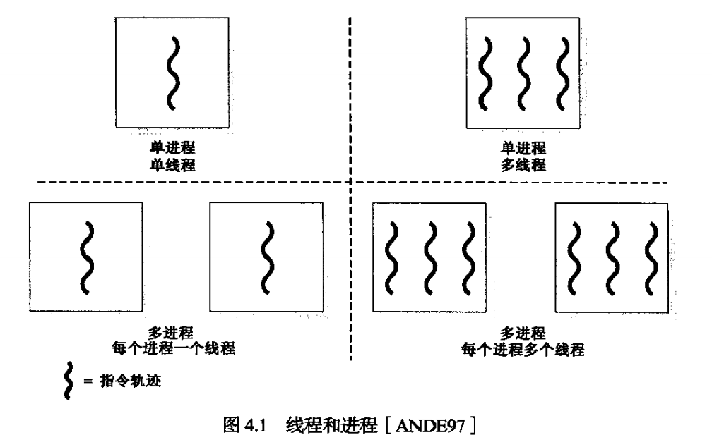
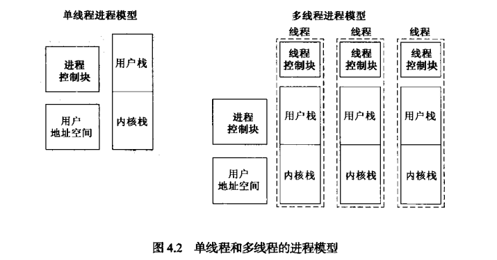
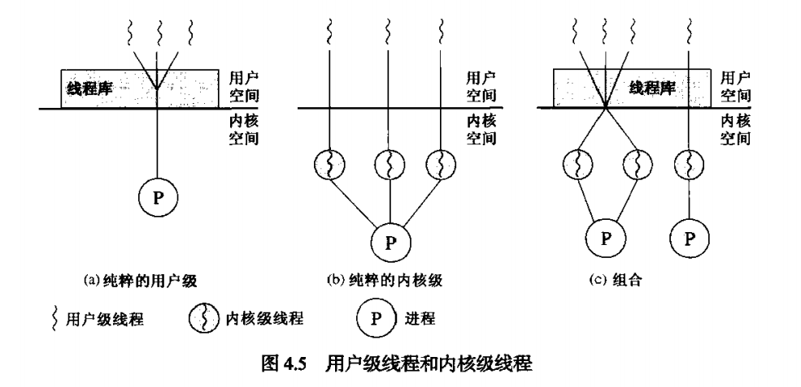

# 线程

> 了解进程与线程的区别  
> 描述线程的基本设计问题  
> 掌握用户级线程和内核级线程的差异  
> 掌握Linux中的线程管理功能

## 1. 进程和线程

之前的进程具有一下两个特点：

- **资源所有权**：包括存放进程映像的虚拟地址空间，对内存、I/O通道、I/O设备和文件等资源的控制权和所有权，以及提供预防进程间不发生不必要资源冲突的保护功能。
- **调度/执行**：进程执行时采用一个或多个程序的执行路径（轨迹），不同进程的执行过程会交替执行，是可以被OS调度和分派的实体。

现在把能分派的单位称为线程或轻量级进程（LWP），掌握资源所有权的单位称为进程或任务。

### 1.1 多线程

多线程是指OS在单个进程内支持多个并发执行路径的能力。在多进程环境中，与进程相关联的有：

- 容纳进程映像的虚拟地址空间。
- 对处理器、其他进程、文件和I/O资源的受保护访问。

与线程相关的有：

- 一个线程的执行状态。
- 未运行时保存的线程上下文。线程可视为在线程内运行的一个独立程序计数器。
- 一个执行栈。
- 每个线程用于局部变量的一些静态存储空间。
- 在线程内其他线程共享的内存和资源的访问。

单线程和多线程模型如下：

线程具有以下优点：

1. 创建线程的时间远小于创建一个进程的时间。
2. 终止线程要比终止进程所花的时间少。
3. 同一进程内线程间切换的时间小于进程间切换的时间。
4. 线程提高了不同执行程序间的通信效率。独立进程间的通信需要内核介入，以提供保护和通信机制，但同进程间的多线程共享内存和文件，因此无需调用内核就可互相通信。

### 1.2 线程的功能

#### 线程状态

线程具有的状态：

- 运行态
- 就绪态
- 阻塞态

#### 线程同步

线程同步的内容和进程同步相同，在后面讲并发的时候会介绍。

## ２. 线程分类

### 2.1 用户级和内核级线程

线程分两大类，**用户级线程**和**内核级线程**，以及二者的结合体**混合方法**。

- **用户级线程**（User-level Thread, ULT）：纯粹的ULT如上图(a)所示，它有用户控件的管理用户级线程的例程，即线程库来实现对多线程的管理。它含有创建和销毁线程的代码、在线程间传递消息和数据的代码、调度线程执行的代码以及保存和恢复线程上下文的代码。对内核来说只有一个进程在执行。
    - 优点：由于始终在用户模式下运行，所以节省了两次模式转换。调度可以为不同的应用程序定制调度算法。ULT不依赖硬件，可以在任意操作系统上运行。
    - 缺点：当一个线程被阻塞的时候，整个进程都会被阻塞。不能充分利用多处理技术，因为被内核当做一个进程所以所有线程都只能在一个核上运行。

- **内核级线程**（Kernel-level Thread, KLT）：纯粹的KLT如上图(b)所示。管理线程的工作由内核完成，即如同前面介绍的，可以把线程作为轻量级进程来调度。
    - 优点：克服了ULT中的两个缺点，把同一个进程中的多个线程可以被调度进多处理器中，且当同一个进程的一个线程被阻塞时，该进程的其他线程仍然可以被调度。
    - 缺点：线程调度需要切换内核模式，会浪费比较多的时间（和ULT比有时可能会差几个数量级）。

- **混合方法**：有些操作体统提供混合ULT和KLT的方法，通过对这二者比例的合理设计使得能充分发挥他们的优点，克服其各自的缺点。

### 2.2 其他方案

有些方案中对多线程进行了更多的扩展，如一个线程可以从一个进程环境迁移到另一个进程环境，允许线程轻松在不同系统中移动（Ra(Clouds)、Emerald），还有多个进程对多个线程（如TRIX系统），感兴趣可以去了解更多这个方面的理论。

## 3. 多核和多线程

